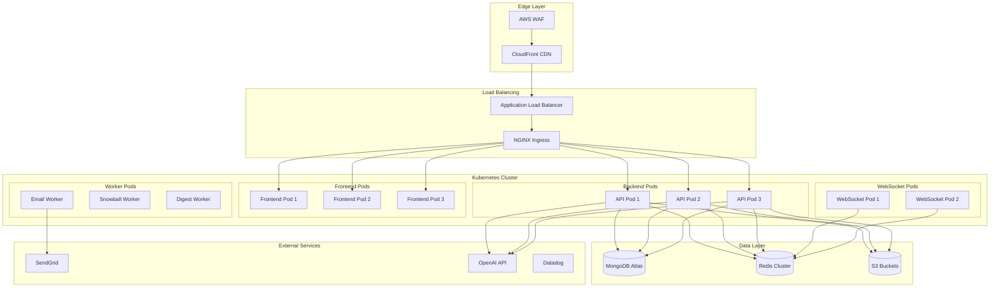

<!--
============================================================================
ShadowNews - Production Deployment Architecture Documentation
============================================================================

Comprehensive guide to ShadowNews production infrastructure, deployment
strategies, and operational procedures for cloud-native architecture.

Purpose:
- Document complete AWS infrastructure and services architecture
- Define deployment pipelines and release management processes
- Provide operational procedures for monitoring and maintenance
- Establish disaster recovery and scaling strategies

Target Audience:
- DevOps engineers managing infrastructure deployments
- Site reliability engineers maintaining production systems
- Platform engineers designing scalable architectures
- Security engineers implementing security controls

Coverage:
- AWS cloud infrastructure with Kubernetes orchestration
- CI/CD pipelines using GitHub Actions and ArgoCD
- Monitoring, logging, and alerting systems
- Auto-scaling policies and load balancing strategies
- Security configurations and access controls
- Disaster recovery and backup procedures

Technical Components:
- Containerized microservices with Docker and Kubernetes
- Service mesh with Istio for traffic management
- Database clustering with MongoDB Atlas
- Caching strategies with Redis and CloudFront CDN
- Message queuing with Amazon SQS and SNS
- Observability stack with Datadog and CloudWatch

Last Updated: 2025-07-27
Version: 1.0.0
============================================================================
-->

# ShadowNews Deployment Architecture

## Overview

Shadownews uses a containerized microservices architecture deployed on AWS with Kubernetes orchestration. The system is designed for high availability, scalability, and zero-downtime deployments.

## Infrastructure Stack

### Core Services
- **Container Orchestration**: Kubernetes (EKS)
- **Container Registry**: Amazon ECR
- **Load Balancer**: AWS ALB with SSL termination
- **CDN**: CloudFront for static assets
- **Database**: MongoDB Atlas (M30 cluster)
- **Cache**: Redis Cluster (ElastiCache)
- **Message Queue**: Amazon SQS
- **Email Service**: SendGrid for transactional emails
- **File Storage**: S3 for CSV uploads and attachments
- **Monitoring**: Datadog + CloudWatch
- **CI/CD**: GitHub Actions + ArgoCD

## Architecture Diagram



## Deployment Configurations

### Production Environment

```yaml
# kubernetes/production/deployment.yaml
apiVersion: apps/v1
kind: Deployment
metadata:
  name: shadownews-backend
  namespace: production
spec:
  replicas: 3
  strategy:
    type: RollingUpdate
    rollingUpdate:
      maxSurge: 1
      maxUnavailable: 0
  selector:
    matchLabels:
      app: shadownews-backend
  template:
    metadata:
      labels:
        app: shadownews-backend
    spec:
      containers:
      - name: backend
        image: YOUR_ECR_REGISTRY/shadownews-backend:latest
        ports:
        - containerPort: 3000
        env:
        - name: NODE_ENV
          value: "production"
        - name: MONGODB_URI
          valueFrom:
            secretKeyRef:
              name: shadownews-secrets
              key: mongodb-uri
        - name: REDIS_URL
          valueFrom:
            secretKeyRef:
              name: shadownews-secrets
              key: redis-url
        resources:
          requests:
            memory: "512Mi"
            cpu: "500m"
          limits:
            memory: "1Gi"
            cpu: "1000m"
        livenessProbe:
          httpGet:
            path: /health
            port: 3000
          initialDelaySeconds: 30
          periodSeconds: 10
        readinessProbe:
          httpGet:
            path: /ready
            port: 3000
          initialDelaySeconds: 5
          periodSeconds: 5
---
apiVersion: v1
kind: Service
metadata:
  name: shadownews-backend-service
  namespace: production
spec:
  selector:
    app: shadownews-backend
  ports:
    - protocol: TCP
      port: 80
      targetPort: 3000
  type: ClusterIP
---
apiVersion: autoscaling/v2
kind: HorizontalPodAutoscaler
metadata:
  name: shadownews-backend-hpa
  namespace: production
spec:
  scaleTargetRef:
    apiVersion: apps/v1
    kind: Deployment
    name: shadownews-backend
  minReplicas: 3
  maxReplicas: 10
  metrics:
  - type: Resource
    resource:
      name: cpu
      target:
        type: Utilization
        averageUtilization: 70
  - type: Resource
    resource:
      name: memory
      target:
        type: Utilization
        averageUtilization: 80
```

### Staging Environment

```yaml
# kubernetes/staging/deployment.yaml
apiVersion: apps/v1
kind: Deployment
metadata:
  name: shadownews-backend
  namespace: staging
spec:
  replicas: 2
  strategy:
    type: RollingUpdate
    rollingUpdate:
      maxSurge: 1
      maxUnavailable: 0
  selector:
    matchLabels:
      app: shadownews-backend
  template:
    metadata:
      labels:
        app: shadownews-backend
    spec:
      containers:
      - name: backend
        image: YOUR_ECR_REGISTRY/shadownews-backend:staging
        ports:
        - containerPort: 3000
        env:
        - name: NODE_ENV
          value: "staging"
        resources:
          requests:
            memory: "256Mi"
            cpu: "250m"
          limits:
            memory: "512Mi"
            cpu: "500m"
```

## CI/CD Pipeline

### GitHub Actions Workflow

```yaml
# .github/workflows/deploy.yml
name: Deploy to Production

on:
  push:
    branches: [main]

jobs:
  test:
    runs-on: ubuntu-latest
    steps:
      - uses: actions/checkout@v3
      
      - name: Setup Node.js
        uses: actions/setup-node@v3
        with:
          node-version: '18'
          
      - name: Install dependencies
        run: |
          cd backend && npm ci
          cd ../frontend && npm ci
          
      - name: Run tests
        run: |
          cd backend && npm test
          cd ../frontend && npm test
          
      - name: Run E2E tests
        run: npm run test:e2e

  build-and-push:
    needs: test
    runs-on: ubuntu-latest
    steps:
      - uses: actions/checkout@v3
      
      - name: Configure AWS credentials
        uses: aws-actions/configure-aws-credentials@v2
        with:
          aws-access-key-id: ${{ secrets.AWS_ACCESS_KEY_ID }}
          aws-secret-access-key: ${{ secrets.AWS_SECRET_ACCESS_KEY }}
          aws-region: us-east-1
          
      - name: Login to Amazon ECR
        id: login-ecr
        uses: aws-actions/amazon-ecr-login@v1
        
      - name: Build and push backend image
        env:
          ECR_REGISTRY: ${{ steps.login-ecr.outputs.registry }}
          ECR_REPOSITORY: shadownews-backend
          IMAGE_TAG: ${{ github.sha }}
        run: |
          cd backend
          docker build -t $ECR_REGISTRY/$ECR_REPOSITORY:$IMAGE_TAG .
          docker tag $ECR_REGISTRY/$ECR_REPOSITORY:$IMAGE_TAG $ECR_REGISTRY/$ECR_REPOSITORY:latest
          docker push $ECR_REGISTRY/$ECR_REPOSITORY:$IMAGE_TAG
          docker push $ECR_REGISTRY/$ECR_REPOSITORY:latest
          
      - name: Build and push frontend image
        env:
          ECR_REGISTRY: ${{ steps.login-ecr.outputs.registry }}
          ECR_REPOSITORY: shadownews-frontend
          IMAGE_TAG: ${{ github.sha }}
        run: |
          cd frontend
          docker build -t $ECR_REGISTRY/$ECR_REPOSITORY:$IMAGE_TAG .
          docker tag $ECR_REGISTRY/$ECR_REPOSITORY:$IMAGE_TAG $ECR_REGISTRY/$ECR_REPOSITORY:latest
          docker push $ECR_REGISTRY/$ECR_REPOSITORY:$IMAGE_TAG
          docker push $ECR_REGISTRY/$ECR_REPOSITORY:latest

  deploy:
    needs: build-and-push
    runs-on: ubuntu-latest
    steps:
      - uses: actions/checkout@v3
      
      - name: Deploy to Kubernetes
        run: |
          # ArgoCD will automatically sync the new images
          curl -X POST ${{ secrets.ARGOCD_WEBHOOK_URL }}
```

## Docker Configuration

### Backend Dockerfile

```dockerfile
# docker/backend/Dockerfile
FROM node:18-alpine AS builder

WORKDIR /app

COPY package*.json ./
RUN npm ci --only=production

COPY . .

FROM node:18-alpine

WORKDIR /app

RUN apk add --no-cache tini

COPY --from=builder /app/node_modules ./node_modules
COPY --from=builder /app .

EXPOSE 3000

USER node

ENTRYPOINT ["/sbin/tini", "--"]
CMD ["node", "src/server.js"]
```

### Frontend Dockerfile

```dockerfile
# docker/frontend/Dockerfile
FROM node:18-alpine AS builder

WORKDIR /app

COPY package*.json ./
RUN npm ci

COPY . .
RUN npm run build

FROM nginx:alpine

COPY --from=builder /app/build /usr/share/nginx/html
COPY nginx.conf /etc/nginx/conf.d/default.conf

EXPOSE 80

CMD ["nginx", "-g", "daemon off;"]
```

### NGINX Configuration

```nginx
# docker/nginx/nginx.conf
server {
    listen 80;
    server_name _;
    
    root /usr/share/nginx/html;
    index index.html;
    
    # Security headers
    add_header X-Frame-Options "SAMEORIGIN" always;
    add_header X-Content-Type-Options "nosniff" always;
    add_header X-XSS-Protection "1; mode=block" always;
    add_header Referrer-Policy "strict-origin-when-cross-origin" always;
    add_header Content-Security-Policy "default-src 'self'; script-src 'self' 'unsafe-inline'; style-src 'self' 'unsafe-inline'; img-src 'self' data: https:; font-src 'self'; connect-src 'self' https://api.artofdigitalshadow.org/shadownews wss://ws.artofdigitalshadow.org/shadownews; frame-ancestors 'none';" always;
    
    # Compression
    gzip on;
    gzip_vary on;
    gzip_min_length 1024;
    gzip_types text/plain text/css text/xml text/javascript application/javascript application/xml+rss application/json;
    
    # Cache static assets
    location ~* \.(js|css|png|jpg|jpeg|gif|ico|svg|woff|woff2|ttf|eot)$ {
        expires 1y;
        add_header Cache-Control "public, immutable";
    }
    
    # Service worker
    location /service-worker.js {
        add_header Cache-Control "no-cache";
    }
    
    # SPA routing
    location / {
        try_files $uri $uri/ /index.html;
    }
}
```

## Infrastructure as Code

### Terraform Configuration

```hcl
# terraform/main.tf
terraform {
  required_providers {
    aws = {
      source  = "hashicorp/aws"
      version = "~> 5.0"
    }
  }
  
  backend "s3" {
    bucket = "shadownews-terraform-state"
    key    = "production/terraform.tfstate"
    region = "us-east-1"
  }
}

provider "aws" {
  region = var.aws_region
}

module "eks" {
  source = "terraform-aws-modules/eks/aws"
  
  cluster_name    = "shadownews-cluster"
  cluster_version = "1.28"
  
  vpc_id     = module.vpc.vpc_id
  subnet_ids = module.vpc.private_subnets
  
  node_groups = {
    main = {
      desired_capacity = 3
      max_capacity     = 10
      min_capacity     = 3
      
      instance_types = ["t3.medium"]
      
      k8s_labels = {
        Environment = "production"
      }
    }
  }
}

module "rds" {
  source = "terraform-aws-modules/rds/aws"
  
  identifier = "shadownews-postgres"
  
  engine            = "postgres"
  engine_version    = "15.4"
  instance_class    = "db.t3.medium"
  allocated_storage = 100
  
  vpc_security_group_ids = [module.security_group.security_group_id]
  
  backup_retention_period = 30
  backup_window          = "03:00-06:00"
  
  enabled_cloudwatch_logs_exports = ["postgresql"]
}

module "elasticache" {
  source = "terraform-aws-modules/elasticache/aws"
  
  cluster_id           = "shadownews-redis"
  engine              = "redis"
  node_type           = "cache.t3.micro"
  num_cache_nodes     = 3
  parameter_group_name = "default.redis7"
  port                = 6379
  
  subnet_group_name = module.vpc.elasticache_subnet_group_name
}

module "s3" {
  source = "terraform-aws-modules/s3-bucket/aws"
  
  bucket = "shadownews-uploads"
  
  versioning = {
    enabled = true
  }
  
  lifecycle_rule = [
    {
      id      = "archive"
      enabled = true
      
      transition = [
        {
          days          = 90
          storage_class = "GLACIER"
        }
      ]
    }
  ]
  
  server_side_encryption_configuration = {
    rule = {
      apply_server_side_encryption_by_default = {
        sse_algorithm = "AES256"
      }
    }
  }
}
```

## Monitoring and Observability

### Datadog Configuration

```yaml
# kubernetes/monitoring/datadog-values.yaml
datadog:
  apiKey: ${DATADOG_API_KEY}
  appKey: ${DATADOG_APP_KEY}
  logs:
    enabled: true
    containerCollectAll: true
  apm:
    enabled: true
  processAgent:
    enabled: true
  systemProbe:
    enabled: true
  networkMonitoring:
    enabled: true
  clusterAgent:
    enabled: true
    metricsProvider:
      enabled: true
  targetSystem: "linux"
```

### Application Metrics

```javascript
// backend/src/utils/metrics.js
const StatsD = require('node-dogstatsd').StatsD;
const dogstatsd = new StatsD();

module.exports = {
  // Track API response times
  trackResponseTime: (route, duration) => {
    dogstatsd.histogram('api.response_time', duration, [`route:${route}`]);
  },
  
  // Track email processing
  trackEmailProcessed: (type, success) => {
    dogstatsd.increment('email.processed', 1, [
      `type:${type}`,
      `status:${success ? 'success' : 'failure'}`
    ]);
  },
  
  // Track snowball distribution
  trackSnowballGrowth: (repositoryId, newEmails) => {
    dogstatsd.gauge('snowball.growth', newEmails, [`repository:${repositoryId}`]);
  },
  
  // Track active users
  trackActiveUsers: (count) => {
    dogstatsd.gauge('users.active', count);
  }
};
```

## Security Configuration

### AWS Security Groups

```hcl
# terraform/security.tf
resource "aws_security_group" "backend" {
  name_prefix = "shadownews-backend-"
  vpc_id      = module.vpc.vpc_id
  
  ingress {
    from_port   = 3000
    to_port     = 3000
    protocol    = "tcp"
    cidr_blocks = [module.vpc.vpc_cidr_block]
  }
  
  egress {
    from_port   = 0
    to_port     = 0
    protocol    = "-1"
    cidr_blocks = ["0.0.0.0/0"]
  }
}

resource "aws_security_group" "database" {
  name_prefix = "shadownews-database-"
  vpc_id      = module.vpc.vpc_id
  
  ingress {
    from_port       = 5432
    to_port         = 5432
    protocol        = "tcp"
    security_groups = [aws_security_group.backend.id]
  }
}
```

### Secrets Management

```yaml
# kubernetes/secrets/sealed-secrets.yaml
apiVersion: bitnami.com/v1alpha1
kind: SealedSecret
metadata:
  name: shadownews-secrets
  namespace: production
spec:
  encryptedData:
    mongodb-uri: AgA7x8Q9... # Encrypted with kubeseal
    redis-url: AgB8y9R0...
    sendgrid-api-key: AgC9z0S1...
    jwt-secret: AgD0a1T2...
    aws-access-key: AgE1b2U3...
    aws-secret-key: AgF2c3V4...
```

## Backup and Disaster Recovery

### MongoDB Backup

```yaml
# kubernetes/backup/mongodb-backup.yaml
apiVersion: batch/v1
kind: CronJob
metadata:
  name: mongodb-backup
  namespace: production
spec:
  schedule: "0 2 * * *"  # Daily at 2 AM
  jobTemplate:
    spec:
      template:
        spec:
          containers:
          - name: backup
            image: mongo:6
            command:
            - sh
            - -c
            - |
              mongodump --uri="${MONGODB_URI}" --out=/backup/dump-$(date +%Y%m%d)
              aws s3 sync /backup s3://shadownews-backups/mongodb/
            env:
            - name: MONGODB_URI
              valueFrom:
                secretKeyRef:
                  name: shadownews-secrets
                  key: mongodb-uri
            volumeMounts:
            - name: backup
              mountPath: /backup
          volumes:
          - name: backup
            emptyDir: {}
          restartPolicy: OnFailure
```

### Disaster Recovery Plan

```markdown
## Recovery Time Objectives (RTO) and Recovery Point Objectives (RPO)

| Service | RTO | RPO |
|---------|-----|-----|
| API Services | 5 minutes | 0 minutes |
| Database | 30 minutes | 1 hour |
| File Storage | 1 hour | 24 hours |
| Email Service | 15 minutes | 0 minutes |

## Recovery Procedures

### 1. Database Recovery
```bash
# Restore from latest backup
mongorestore --uri="${MONGODB_URI}" --drop /backup/dump-20240115

# Verify data integrity
mongo "${MONGODB_URI}" --eval "db.runCommand({dbStats: 1})"
```

### 2. Service Recovery
```bash
# Scale down all services
kubectl scale deployment --all --replicas=0 -n production

# Restore services in order
kubectl scale deployment shadownews-backend --replicas=3 -n production
kubectl scale deployment shadownews-frontend --replicas=3 -n production
kubectl scale deployment shadownews-workers --replicas=2 -n production
```

### 3. Data Verification
```bash
# Run health checks
curl -f https://api.artofdigitalshadow.org/shadownews/health
curl -f https://artofdigitalshadow.org/shadownews/

# Verify critical functions
npm run test:production
```
```

## Performance Optimization

### CDN Configuration

```javascript
// cloudfront-config.js
module.exports = {
  distribution: {
    origins: [{
      domainName: 'artofdigitalshadow.org/shadownews',
      originId: 'shadownews-alb',
      customOriginConfig: {
        HTTPPort: 80,
        HTTPSPort: 443,
        originProtocolPolicy: 'https-only'
      }
    }],
    defaultCacheBehavior: {
      targetOriginId: 'shadownews-alb',
      viewerProtocolPolicy: 'redirect-to-https',
      allowedMethods: ['GET', 'HEAD', 'OPTIONS', 'PUT', 'POST', 'PATCH', 'DELETE'],
      compress: true,
      cachePolicyId: 'Managed-CachingOptimized'
    },
    customErrorResponses: [{
      errorCode: 404,
      responseCode: 200,
      responsePagePath: '/index.html',
      errorCachingMinTTL: 300
    }]
  }
};
```

### Database Optimization

```javascript
// backend/src/config/database.config.js
module.exports = {
  mongodb: {
    options: {
      maxPoolSize: 100,
      minPoolSize: 10,
      maxIdleTimeMS: 10000,
      compressors: ['zlib'],
      retryWrites: true,
      w: 'majority',
      readPreference: 'secondaryPreferred',
      readConcern: { level: 'majority' }
    },
    indexes: [
      { collection: 'posts', index: { createdAt: -1, score: -1 } },
      { collection: 'posts', index: { 'author.id': 1, createdAt: -1 } },
      { collection: 'posts', index: { hashtags: 1 } },
      { collection: 'repositories', index: { topic: 1, memberCount: -1 } },
      { collection: 'emails', index: { repositoryId: 1, verified: 1 } }
    ]
  }
};
```

## Deployment Checklist

### Pre-Deployment
- [ ] All tests passing (unit, integration, E2E)
- [ ] Security scan completed (Snyk, OWASP)
- [ ] Performance benchmarks met
- [ ] Database migrations prepared
- [ ] Rollback plan documented
- [ ] Monitoring alerts configured
- [ ] Load testing completed

### Deployment Steps
1. [ ] Create database backup
2. [ ] Deploy to staging environment
3. [ ] Run smoke tests on staging
4. [ ] Deploy to production (canary)
5. [ ] Monitor metrics for 15 minutes
6. [ ] Complete rolling deployment
7. [ ] Run production smoke tests
8. [ ] Update status page

### Post-Deployment
- [ ] Monitor error rates
- [ ] Check performance metrics
- [ ] Verify email delivery
- [ ] Test critical user flows
- [ ] Update documentation
- [ ] Send deployment notification

## Rollback Procedures

```bash
#!/bin/bash
# scripts/rollback.sh

PREVIOUS_VERSION=$1

echo "Starting rollback to version: $PREVIOUS_VERSION"

# Update Kubernetes deployments
kubectl set image deployment/shadownews-backend backend=YOUR_ECR_REGISTRY/shadownews-backend:$PREVIOUS_VERSION -n production
kubectl set image deployment/shadownews-frontend frontend=YOUR_ECR_REGISTRY/shadownews-frontend:$PREVIOUS_VERSION -n production

# Wait for rollout to complete
kubectl rollout status deployment/shadownews-backend -n production
kubectl rollout status deployment/shadownews-frontend -n production

# Run health checks
./scripts/health-check.sh

echo "Rollback completed"
```

## Cost Optimization

### Resource Allocation
```yaml
# Optimal resource allocation based on load testing
resources:
  backend:
    requests:
      memory: "512Mi"
      cpu: "500m"
    limits:
      memory: "1Gi"
      cpu: "1000m"
  
  frontend:
    requests:
      memory: "128Mi"
      cpu: "100m"
    limits:
      memory: "256Mi"
      cpu: "200m"
  
  workers:
    requests:
      memory: "256Mi"
      cpu: "250m"
    limits:
      memory: "512Mi"
      cpu: "500m"
```

### Auto-scaling Configuration
```yaml
# HPA settings for cost-effective scaling
horizontalPodAutoscaler:
  backend:
    minReplicas: 3
    maxReplicas: 10
    targetCPU: 70
    targetMemory: 80
    scaleDownStabilization: 300
  
  frontend:
    minReplicas: 2
    maxReplicas: 5
    targetCPU: 80
    targetMemory: 85
    scaleDownStabilization: 300
```

## Maintenance Windows

| Environment | Window | Frequency |
|-------------|--------|-----------|
| Production | Sunday 2-4 AM UTC | Monthly |
| Staging | Wednesday 2-4 AM UTC | Weekly |
| Development | Daily 2-3 AM UTC | Daily |

## Contact Information

### Escalation Path
1. On-call Engineer: +1-XXX-XXX-XXXX
2. DevOps Lead: shadownews@artofdigitalshadow.org
3. CTO: shadownews@artofdigitalshadow.org

### External Vendors
- AWS Support: Enterprise Support Plan
- MongoDB Atlas: 24/7 Support
- SendGrid: Premium Support
- Datadog: Business Plan