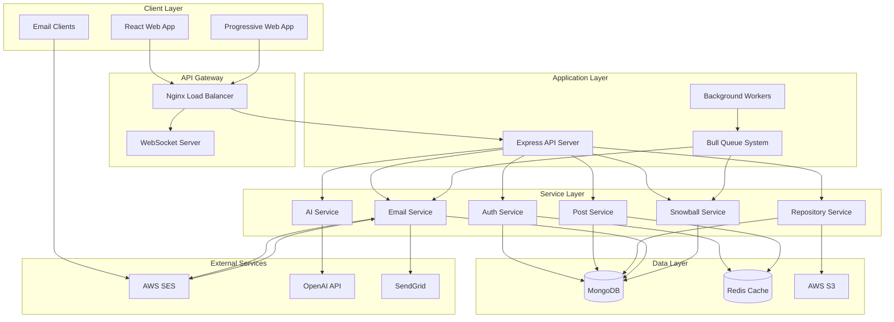
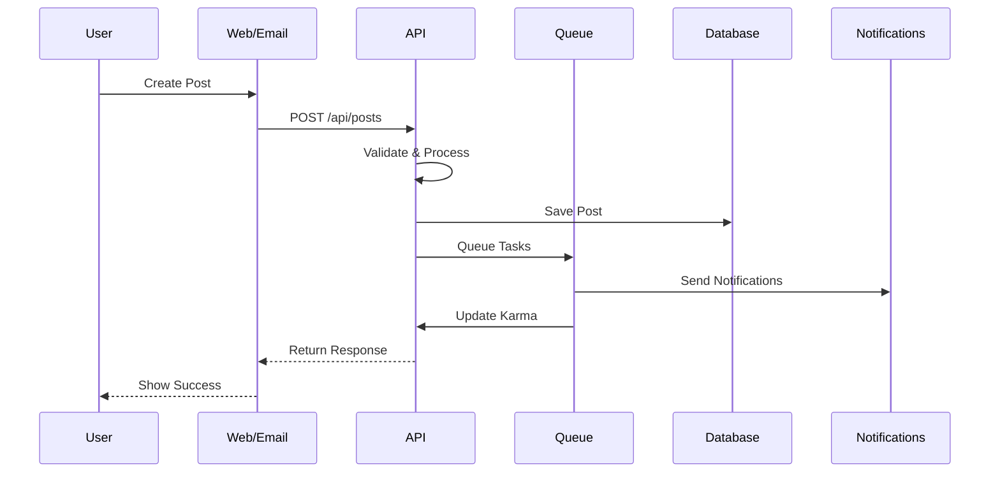
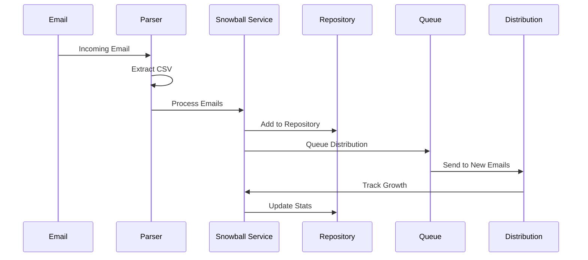
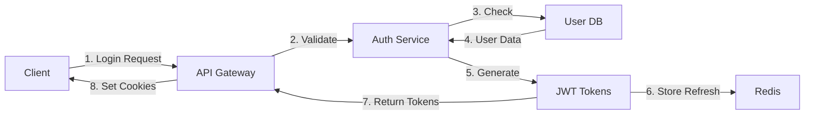
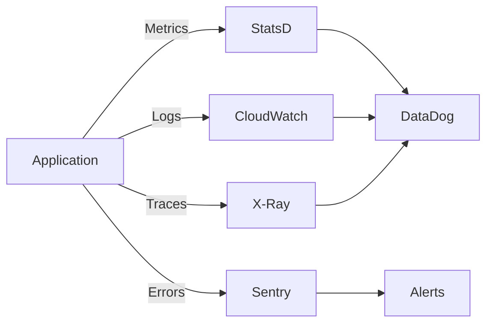
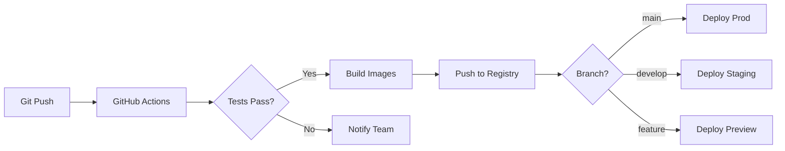

/**
 * @fileoverview overview.md
 * 
 * Implementation file for overview.md
 * 
 * Key Features:
 * - Core functionality
 * - Error handling
 * - Performance optimization
 * 
 * Dependencies:
 *  * - No external dependencies
 * 
 * @author ShadowNews Team
 * @version 1.0.0
 * @since 2024-01-01
 * @lastModified 2025-07-27
 */\n\n<!--
============================================================================
ShadowNews - System Architecture Overview Documentation
============================================================================

High-level architectural documentation providing comprehensive overview of
ShadowNews platform design, component interactions, and system boundaries.

Purpose:
- Provide system-wide architectural understanding
- Define component relationships and data flow patterns
- Establish design principles and architectural decisions
- Guide development team alignment and technical decisions

Target Audience:
- Software architects designing system components
- Senior developers understanding system boundaries
- Product managers planning feature development
- Technical leads making architectural decisions

Coverage:
- Multi-tier architecture with clear separation of concerns
- Microservices design patterns and service boundaries
- Email-first interaction patterns and content processing
- Real-time communication and WebSocket architecture
- AI integration for content enhancement and moderation
- Scalability patterns and performance considerations

System Layers:
- Presentation Layer: React frontend and PWA
- API Gateway: Load balancing and request routing
- Application Layer: Express.js services and workers
- Service Layer: Business logic and domain services
- Data Layer: MongoDB, Redis, and external integrations

Last Updated: 2025-07-27
Version: 1.0.0
============================================================================
-->

# ShadowNews Architecture Overview

## System Architecture



## Core Components

### Frontend Architecture

```
┌─────────────────────────────────────────────────────────────┐
│                         React Application                     │
├─────────────────────────────────────────────────────────────┤
│                      Redux State Management                   │
├─────────────────────────────────────────────────────────────┤
│  Pages    │  Components  │  Hooks    │  Services  │  Utils  │
├───────────┼──────────────┼───────────┼────────────┼─────────┤
│ • Home    │ • PostCard   │ • useAuth │ • API      │ • Format│
│ • Posts   │ • Repository │ • usePosts│ • WebSocket│ • Valid │
│ • Profile │ • Comments   │ • useWS   │ • Email    │ • Const │
└─────────────┴──────────────┴───────────┴────────────┴─────────┘
```

### Backend Architecture

```
┌─────────────────────────────────────────────────────────────┐
│                      Express Application                      │
├─────────────────────────────────────────────────────────────┤
│                        Middleware Stack                       │
├─────────────────────────────────────────────────────────────┤
│   Routes   │ Controllers │  Services  │   Models   │  Utils │
├────────────┼─────────────┼────────────┼────────────┼────────┤
│ • /auth    │ • AuthCtrl  │ • AuthSvc  │ • User     │ • DB   │
│ • /posts   │ • PostCtrl  │ • EmailSvc │ • Post     │ • Redis│
│ • /repos   │ • RepoCtrl  │ • SnowSvc  │ • Repo     │ • Log  │
└────────────┴─────────────┴────────────┴────────────┴────────┘
```

## Data Flow

### Post Creation Flow



### Email Repository Snowball Flow



## Technology Stack

### Frontend
- **Framework**: React 18 with TypeScript
- **State Management**: Redux Toolkit
- **Styling**: Tailwind CSS + Styled Components
- **Build Tool**: Vite
- **Testing**: Jest + React Testing Library + Cypress
- **PWA**: Workbox

### Backend
- **Runtime**: Node.js 20 LTS
- **Framework**: Express.js
- **Database**: MongoDB 7.0
- **Cache**: Redis 7.2
- **Queue**: Bull (Redis-based)
- **WebSocket**: Socket.io
- **Testing**: Jest + Supertest

### Infrastructure
- **Container**: Docker
- **Orchestration**: Docker Compose (dev), Kubernetes (prod)
- **Load Balancer**: Nginx
- **CDN**: CloudFlare
- **Storage**: AWS S3
- **Email**: AWS SES + SendGrid

### Third-party Services
- **AI**: OpenAI GPT-4
- **Analytics**: Mixpanel
- **Error Tracking**: Sentry
- **Monitoring**: DataDog
- **CI/CD**: GitHub Actions

## Database Schema

### Collections Structure

```javascript
// Users Collection
{
  _id: ObjectId,
  email: String,
  username: String,
  password: String, // bcrypt hashed
  shadownewsEmail: String, // username@shadownews.community
  karma: Number,
  badges: [String],
  preferences: {
    emailDigest: Boolean,
    digestFrequency: String,
    privateProfile: Boolean
  },
  createdAt: Date,
  updatedAt: Date
}

// Posts Collection
{
  _id: ObjectId,
  title: String,
  content: String,
  url: String,
  author: ObjectId,
  hashtags: [String],
  score: Number,
  commentCount: Number,
  repositories: [ObjectId],
  emailMetadata: {
    messageId: String,
    receivedVia: String
  },
  createdAt: Date,
  updatedAt: Date
}

// Repositories Collection
{
  _id: ObjectId,
  name: String,
  description: String,
  owner: ObjectId,
  emails: [{
    email: String,
    addedBy: ObjectId,
    addedAt: Date,
    verified: Boolean,
    source: String // 'manual', 'csv', 'snowball'
  }],
  hashtags: [String],
  stats: {
    totalEmails: Number,
    verifiedEmails: Number,
    growthRate: Number,
    lastSnowball: Date
  },
  settings: {
    public: Boolean,
    autoApprove: Boolean,
    qualityThreshold: Number
  },
  createdAt: Date,
  updatedAt: Date
}

// Comments Collection
{
  _id: ObjectId,
  post: ObjectId,
  parent: ObjectId, // null for top-level
  author: ObjectId,
  content: String,
  score: Number,
  depth: Number,
  createdAt: Date,
  updatedAt: Date
}

// Email Queue Collection
{
  _id: ObjectId,
  to: [String],
  from: String,
  subject: String,
  template: String,
  data: Object,
  status: String, // 'pending', 'sent', 'failed'
  attempts: Number,
  scheduledFor: Date,
  sentAt: Date,
  error: String
}
```

## API Design

### RESTful Endpoints

```
Authentication
POST   /api/auth/register
POST   /api/auth/login
POST   /api/auth/logout
POST   /api/auth/refresh
GET    /api/auth/verify-email/:token

Posts
GET    /api/posts                 # List posts
GET    /api/posts/:id            # Get single post
POST   /api/posts                # Create post
PUT    /api/posts/:id            # Update post
DELETE /api/posts/:id            # Delete post
POST   /api/posts/:id/vote       # Vote on post

Comments
GET    /api/posts/:postId/comments      # Get comments
POST   /api/posts/:postId/comments      # Create comment
PUT    /api/comments/:id                # Update comment
DELETE /api/comments/:id                # Delete comment
POST   /api/comments/:id/vote           # Vote on comment

Repositories
GET    /api/repositories                 # List repositories
GET    /api/repositories/:id            # Get repository
POST   /api/repositories                # Create repository
PUT    /api/repositories/:id            # Update repository
DELETE /api/repositories/:id            # Delete repository
POST   /api/repositories/:id/emails     # Add emails
POST   /api/repositories/:id/import-csv # Import CSV
GET    /api/repositories/:id/export     # Export emails
POST   /api/repositories/:id/snowball   # Trigger snowball

Users
GET    /api/users/:username             # Get profile
PUT    /api/users/profile              # Update profile
GET    /api/users/karma                # Get karma details
PUT    /api/users/preferences          # Update preferences

Email
POST   /api/email/receive              # Webhook for incoming
GET    /api/email/stats                # Email statistics
POST   /api/email/test                 # Test email setup
```

### WebSocket Events

```javascript
// Client -> Server
socket.emit('join:post', postId)
socket.emit('leave:post', postId)
socket.emit('join:feed', feedType)
socket.emit('typing:start', { postId, commentId })
socket.emit('typing:stop', { postId, commentId })

// Server -> Client
socket.emit('post:new', postData)
socket.emit('post:updated', { postId, changes })
socket.emit('comment:new', commentData)
socket.emit('vote:updated', { type, id, score })
socket.emit('user:typing', { userId, location })
socket.emit('repository:growth', { repoId, newCount })
```

## Security Architecture

### Authentication Flow



### Security Measures

- **Authentication**: JWT with refresh tokens
- **Authorization**: Role-based access control (RBAC)
- **Rate Limiting**: IP and user-based limits
- **Input Validation**: Joi schemas
- **SQL Injection**: Parameterized queries
- **XSS Prevention**: Content sanitization
- **CSRF Protection**: Double submit cookies
- **Encryption**: TLS 1.3, bcrypt for passwords
- **Headers**: Helmet.js security headers
- **CORS**: Whitelist allowed origins
- **File Upload**: Type validation, size limits
- **Email Security**: SPF, DKIM, DMARC

## Performance Optimization

### Caching Strategy

```
┌─────────────────┐
│   CloudFlare    │  ← Static assets, API caching
├─────────────────┤
│     Nginx       │  ← Response caching
├─────────────────┤
│   Redis Cache   │  ← Session, hot data
├─────────────────┤
│   Application   │  ← In-memory caching
├─────────────────┤
│    MongoDB      │  ← Indexed queries
└─────────────────┘
```

### Optimization Techniques

- **Database**: Compound indexes, aggregation pipelines
- **API**: Response compression, pagination
- **Frontend**: Code splitting, lazy loading
- **Images**: WebP format, responsive images
- **Caching**: Multi-layer caching strategy
- **CDN**: Static asset distribution
- **WebSocket**: Connection pooling
- **Background Jobs**: Priority queues

## Scalability Design

### Horizontal Scaling

```
                    Load Balancer
                         │
        ┌────────────────┼────────────────┐
        │                │                │
    API Server 1    API Server 2    API Server 3
        │                │                │
        └────────────────┼────────────────┘
                         │
                 Shared Services
                    │       │
                MongoDB   Redis
```

### Microservices Ready

- **Service Boundaries**: Clear separation of concerns
- **Message Queue**: Asynchronous communication
- **Service Discovery**: Environment-based configuration
- **Health Checks**: Readiness and liveness probes
- **Circuit Breakers**: Fault tolerance
- **Rate Limiting**: Per-service limits
- **Monitoring**: Distributed tracing

## Deployment Architecture

### Development Environment

```yaml
docker-compose.yml:
  - frontend (port 3000)
  - backend (port 5000)
  - mongodb (port 27017)
  - redis (port 6379)
  - mailhog (port 8025)
```

### Production Environment

```
┌─────────────────────────────────────────┐
│            CloudFlare CDN                │
├─────────────────────────────────────────┤
│          AWS Load Balancer               │
├─────────────┬─────────────┬─────────────┤
│   ECS       │   ECS       │   ECS       │
│ Container 1 │ Container 2 │ Container 3 │
├─────────────┴─────────────┴─────────────┤
│          AWS DocumentDB (MongoDB)        │
├─────────────────────────────────────────┤
│          AWS ElastiCache (Redis)        │
├─────────────────────────────────────────┤
│              AWS S3 (Storage)            │
└─────────────────────────────────────────┘
```

## Monitoring & Observability

### Metrics Collection



### Key Metrics

- **Application**: Response time, error rate, throughput
- **Business**: New users, posts/day, email delivery rate
- **Infrastructure**: CPU, memory, disk usage
- **Database**: Query performance, connection pool
- **Cache**: Hit rate, eviction rate
- **Queue**: Job processing time, failure rate

## Disaster Recovery

### Backup Strategy

- **Database**: Daily automated backups, point-in-time recovery
- **File Storage**: S3 versioning and replication
- **Configuration**: Git version control
- **Secrets**: AWS Secrets Manager

### Recovery Procedures

1. **RTO**: 1 hour (Recovery Time Objective)
2. **RPO**: 1 hour (Recovery Point Objective)
3. **Failover**: Automated with health checks
4. **Data Recovery**: Automated restore scripts
5. **Communication**: Status page updates

## Development Workflow

### CI/CD Pipeline



### Environment Strategy

- **Local**: Docker Compose setup
- **Preview**: Feature branch deployments
- **Staging**: Production mirror
- **Production**: Blue-green deployment