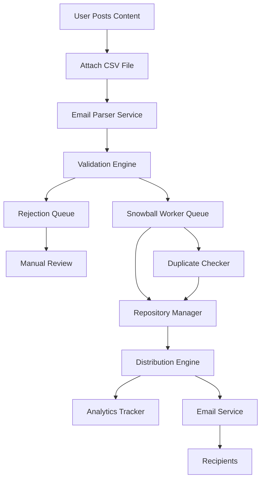

<!--
============================================================================
ShadowNews - Snowball Distribution System Documentation
============================================================================

Comprehensive documentation for ShadowNews' innovative snowball distribution
system, enabling viral growth through CSV-based email network expansion.

Purpose:
- Define viral distribution mechanics and growth algorithms
- Document CSV processing workflows and validation systems
- Establish organic community growth and network effects
- Provide integration guides for distribution management

Target Audience:
- Product managers understanding viral growth mechanics
- Backend developers implementing distribution systems
- Growth engineers optimizing viral coefficients
- Community managers leveraging network effects

Coverage:
- Viral distribution algorithms and snowball mechanics
- CSV upload processing and email validation workflows
- Repository auto-assignment and topic matching
- Opt-in verification and consent management
- Growth analytics and viral coefficient tracking
- Anti-spam measures and abuse prevention

Key Features:
- Automated CSV processing with email extraction
- Intelligent repository assignment based on content topics
- Viral growth mechanics with quality preservation
- Real-time validation and duplicate prevention
- Analytics dashboard for tracking viral coefficients
- Community-driven moderation and quality control

Technical Components:
- Background job processing for bulk operations
- Email validation and deliverability services
- Machine learning for topic classification
- Real-time analytics and growth tracking
- Anti-spam and fraud detection systems
- Integration with email service providers

Last Updated: 2025-07-27
Version: 1.0.0
============================================================================
-->

# Snowball Distribution System

## Overview

The Snowball Distribution System is Shadownews' core innovation that enables organic growth of topic-based email repositories through viral sharing mechanisms. When users share content with attached CSV files containing email addresses, these addresses can be automatically added to relevant repositories, creating a snowball effect of community growth.

## Architecture

### System Components



### Data Flow

1. **Initial Upload**: User uploads CSV with email addresses
2. **Validation**: System validates email formats and checks against blocklists
3. **Deduplication**: Prevents duplicate entries in repositories
4. **Permission Check**: Verifies opt-in status for new addresses
5. **Distribution**: Adds verified emails to appropriate repositories
6. **Notification**: Sends welcome emails to new repository members
7. **Analytics**: Tracks growth metrics and viral coefficients

## Implementation

### Database Schema

```javascript
// Repository Schema
{
  _id: ObjectId,
  name: String,
  description: String,
  topic: String,
  hashtags: [String],
  owner: ObjectId,
  emails: [{
    address: String,
    addedBy: ObjectId,
    addedAt: Date,
    source: Enum['manual', 'csv', 'snowball', 'api'],
    verificationStatus: Enum['pending', 'verified', 'rejected'],
    optInStatus: Boolean,
    engagementScore: Number,
    metadata: {
      originalFile: String,
      snowballGeneration: Number,
      parentEmail: String
    }
  }],
  settings: {
    autoApprove: Boolean,
    minQualityScore: Number,
    maxSnowballDepth: Number,
    dailyAddLimit: Number,
    requireDoubleOptIn: Boolean
  },
  stats: {
    totalEmails: Number,
    verifiedEmails: Number,
    snowballMultiplier: Number,
    growthRate: Number,
    lastUpdated: Date
  }
}

// Snowball Event Schema
{
  _id: ObjectId,
  repositoryId: ObjectId,
  uploaderId: ObjectId,
  csvFile: {
    filename: String,
    size: Number,
    uploadDate: Date,
    s3Key: String
  },
  emails: [{
    address: String,
    status: Enum['pending', 'added', 'rejected', 'duplicate'],
    reason: String,
    processedAt: Date
  }],
  generation: Number,
  parentEventId: ObjectId,
  stats: {
    totalEmails: Number,
    addedEmails: Number,
    rejectedEmails: Number,
    duplicateEmails: Number
  },
  createdAt: Date,
  processedAt: Date
}
```

### API Endpoints

#### Upload CSV for Snowball Distribution
```
POST /api/repositories/:id/snowball
Content-Type: multipart/form-data

Request:
- file: CSV file (required)
- settings: {
    autoApprove: boolean,
    notifyNewMembers: boolean,
    customMessage: string
  }

Response:
{
  "eventId": "507f1f77bcf86cd799439011",
  "status": "processing",
  "estimatedEmails": 1500,
  "processingTime": "2-5 minutes"
}
```

#### Get Snowball Event Status
```
GET /api/repositories/:id/snowball/:eventId

Response:
{
  "eventId": "507f1f77bcf86cd799439011",
  "status": "completed",
  "generation": 2,
  "stats": {
    "uploaded": 1500,
    "processed": 1500,
    "added": 1247,
    "rejected": 53,
    "duplicates": 200
  },
  "details": {
    "rejectionReasons": {
      "invalid_format": 23,
      "blocklisted": 10,
      "opted_out": 20
    }
  },
  "snowballEffect": {
    "nextGenPotential": 3741,
    "viralCoefficient": 2.49
  }
}
```

#### Repository Growth Analytics
```
GET /api/repositories/:id/analytics/snowball

Response:
{
  "repositoryId": "507f1f77bcf86cd799439011",
  "period": "30d",
  "growth": {
    "total": 5420,
    "organic": 1200,
    "snowball": 4220,
    "generationBreakdown": {
      "gen1": 1000,
      "gen2": 2100,
      "gen3": 1120
    }
  },
  "viralMetrics": {
    "coefficient": 3.2,
    "amplificationRate": 4.22,
    "averageGenSize": 1406
  },
  "topContributors": [
    {
      "userId": "507f1f77bcf86cd799439012",
      "emailsAdded": 823,
      "generations": 3
    }
  ]
}
```

### Core Services

#### Snowball Service
```javascript
// backend/src/services/snowball.service.js
class SnowballService {
  async processCSV(repositoryId, csvFile, uploaderId, settings) {
    // Create snowball event
    // Parse CSV file
    // Validate emails
    // Check duplicates
    // Apply repository rules
    // Queue for processing
    // Return event ID
  }

  async calculateViralCoefficient(repositoryId) {
    // Analyze growth patterns
    // Calculate generation multipliers
    // Return viral metrics
  }

  async predictGrowth(repositoryId, generations = 3) {
    // Use historical data
    // Apply viral coefficient
    // Return growth projections
  }
}
```

#### Email Validation Service
```javascript
// backend/src/services/emailValidation.service.js
class EmailValidationService {
  async validateBatch(emails) {
    // Format validation
    // Domain verification
    // Blocklist checking
    // Duplicate detection
    // Return validation results
  }

  async checkOptInStatus(email) {
    // Check global opt-out list
    // Check repository-specific preferences
    // Return permission status
  }
}
```

### Worker Implementation

```javascript
// backend/src/workers/snowball.worker.js
const Queue = require('bull');
const snowballQueue = new Queue('snowball-processing');

snowballQueue.process(async (job) => {
  const { eventId, repositoryId, emails } = job.data;
  
  // Process in batches
  const BATCH_SIZE = 100;
  const results = {
    added: [],
    rejected: [],
    duplicates: []
  };

  for (let i = 0; i < emails.length; i += BATCH_SIZE) {
    const batch = emails.slice(i, i + BATCH_SIZE);
    
    // Validate emails
    const validated = await emailValidationService.validateBatch(batch);
    
    // Check for duplicates
    const unique = await repositoryService.filterDuplicates(repositoryId, validated.valid);
    
    // Add to repository
    const added = await repositoryService.addEmails(repositoryId, unique);
    
    // Update results
    results.added.push(...added);
    results.rejected.push(...validated.invalid);
    results.duplicates.push(...validated.duplicates);
    
    // Update progress
    job.progress((i + BATCH_SIZE) / emails.length * 100);
  }

  // Send notifications
  if (results.added.length > 0) {
    await notificationService.notifyNewMembers(repositoryId, results.added);
  }

  // Update event status
  await snowballEventModel.findByIdAndUpdate(eventId, {
    status: 'completed',
    stats: {
      addedEmails: results.added.length,
      rejectedEmails: results.rejected.length,
      duplicateEmails: results.duplicates.length
    },
    processedAt: new Date()
  });

  // Calculate next generation potential
  const viralMetrics = await snowballService.calculateViralCoefficient(repositoryId);
  
  return { results, viralMetrics };
});
```

## Frontend Components

### Snowball Visualizer Component
```typescript
// frontend/src/components/repositories/SnowballVisualizer/SnowballVisualizer.tsx
interface SnowballVisualizerProps {
  repositoryId: string;
  generations: number;
}

const SnowballVisualizer: React.FC<SnowballVisualizerProps> = ({ repositoryId, generations }) => {
  // Fetch snowball data
  // Render D3.js visualization
  // Show growth projections
  // Display viral coefficient
  // Interactive generation explorer
};
```

### CSV Upload Component
```typescript
// frontend/src/components/repositories/CSVUploader/CSVUploader.tsx
interface CSVUploaderProps {
  repositoryId: string;
  onUploadComplete: (eventId: string) => void;
}

const CSVUploader: React.FC<CSVUploaderProps> = ({ repositoryId, onUploadComplete }) => {
  // Drag and drop interface
  // CSV preview
  // Validation feedback
  // Upload progress
  // Settings configuration
};
```

## Security Considerations

### Privacy Protection
- **Email Hashing**: Store hashed versions for duplicate checking
- **Opt-Out Registry**: Global blocklist for users who don't want to be added
- **GDPR Compliance**: Right to erasure, data portability
- **Rate Limiting**: Prevent spam and abuse

### Quality Control
- **Reputation Scoring**: Track user behavior for trust levels
- **Manual Review Queue**: Flag suspicious uploads
- **Domain Verification**: Validate email domains
- **Engagement Tracking**: Remove inactive emails

### Anti-Abuse Measures
```javascript
const antiAbuseRules = {
  maxDailyUploads: 5,
  maxEmailsPerUpload: 5000,
  minAccountAge: 7, // days
  minKarmaRequired: 100,
  suspiciousPatterns: [
    /test\d+@/,
    /noreply@/,
    /donotreply@/
  ],
  blockedDomains: [
    'tempmail.com',
    'guerrillamail.com'
  ]
};
```

## Performance Optimization

### Batch Processing
- Process emails in chunks of 100-500
- Use Redis for deduplication cache
- Implement progressive loading for large CSVs

### Caching Strategy
```javascript
const cacheKeys = {
  repositoryEmails: `repo:${id}:emails`,
  duplicateCheck: `repo:${id}:duplicates`,
  viralMetrics: `repo:${id}:viral`,
  userUploadLimit: `user:${id}:uploads:daily`
};
```

### Database Indexes
```javascript
// Optimize for snowball queries
db.repositories.createIndex({ "emails.address": 1 });
db.repositories.createIndex({ "emails.addedAt": -1 });
db.snowballEvents.createIndex({ repositoryId: 1, generation: 1 });
db.snowballEvents.createIndex({ uploaderId: 1, createdAt: -1 });
```

## Analytics and Metrics

### Key Performance Indicators
- **Viral Coefficient (K)**: Average new users per existing user
- **Amplification Rate**: Total reach / initial upload
- **Generation Decay**: Growth rate per generation
- **Quality Score**: Engagement rate of snowballed users

### Tracking Implementation
```javascript
const trackSnowballMetrics = async (eventId) => {
  const metrics = {
    eventId,
    timestamp: new Date(),
    generation: event.generation,
    uploadSize: event.emails.length,
    addedCount: event.stats.addedEmails,
    viralCoefficient: calculateViralCoefficient(event),
    projectedReach: projectFutureGrowth(event),
    qualityScore: await calculateQualityScore(event)
  };
  
  await analytics.track('snowball_processed', metrics);
};
```

## Configuration

### Environment Variables
```bash
# Snowball Configuration
SNOWBALL_MAX_GENERATION_DEPTH=5
SNOWBALL_BATCH_SIZE=500
SNOWBALL_PROCESSING_TIMEOUT=300000
SNOWBALL_DAILY_LIMIT_PER_USER=5
SNOWBALL_MAX_FILE_SIZE=10485760
SNOWBALL_QUALITY_THRESHOLD=0.7
SNOWBALL_AUTO_APPROVE_THRESHOLD=0.9
```

### Repository Settings
```javascript
const defaultRepositorySettings = {
  snowball: {
    enabled: true,
    autoApprove: false,
    maxGenerationDepth: 3,
    minQualityScore: 0.5,
    requireDoubleOptIn: true,
    dailyAddLimit: 1000,
    notificationTemplate: 'default',
    customRules: []
  }
};
```

## Testing

### Unit Tests
```javascript
// backend/tests/unit/services/snowball.service.test.js
describe('SnowballService', () => {
  describe('processCSV', () => {
    it('should validate email formats');
    it('should detect duplicates');
    it('should respect repository limits');
    it('should calculate viral coefficient');
  });
});
```

### Integration Tests
```javascript
// backend/tests/integration/snowball.test.js
describe('Snowball Distribution E2E', () => {
  it('should process CSV upload end-to-end');
  it('should handle concurrent uploads');
  it('should enforce rate limits');
  it('should track analytics correctly');
});
```

## Monitoring

### Health Checks
- Queue depth monitoring
- Processing time alerts
- Error rate tracking
- Viral coefficient trends

### Dashboards
- Real-time snowball events
- Repository growth charts
- User contribution leaderboard
- System performance metrics

## Future Enhancements

### Machine Learning Integration
- Predict viral potential of uploads
- Identify high-quality email sources
- Optimize notification timing
- Detect anomalous growth patterns

### Advanced Features
- Cross-repository snowballing
- Snowball chains visualization
- Gamification elements
- API for third-party integrations